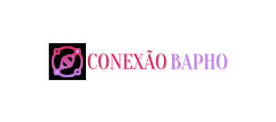
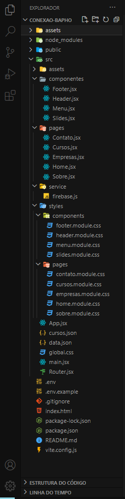
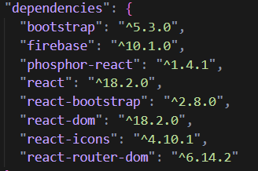

<h1  align="center">

 
</h1>

## Apresentação

### 👩‍💻 Quem é a Cyberlua?

<h1 align="center">

 

</h1>

[Luna Trevisan](https://www.instagram.com/cyberlua7/), é uma nordestina - Pernambuco meu amô, apaixonada pelos jogos eletrônicos e pelo universo da tecnologia, e claro, amando essa área da programação onde estou me formando em desenvolvedora Front-End pela Reprograma. E com muita sede de aprender mais linguagens e tecnologias chegou meu momento de fazer uma imersão onde eu possa externalizar essa minha paixão.

#### Contatos

-  [E-mail](cyberlua7@gmail.com)

-  [LinkedIn](https://www.linkedin.com/in/cyberlua7/)

-  [GitHub](https://github.com/cyberlua)

## Conhecendo o projeto (Conexão Bapho)

### 🧠 Contexto

Com o objetivo de criar um projeto que tenha a função de impactar socialmente de forma positiva, criei um web site onde destaco empresas e instituições de ensino que trabalham com a diversidade e inclusão da comunidade LGBT. Também trago dados de uma realidade que infelizmente ainda continua presente em nossa sociedade e claro, minha vivência e experiências como base de um pensamento indagante e argumentativo. Pensando nisso e como eu posso ajudar de forma coletiva compartilhando meus conhecimentos de desenvolvedora web, me dei a missão de promover a conscientização e reconhecimento das empresas e instituições de ensino que estão fazendo a diferença, acolhendo a diversidade como um valor fudamental e trabalhando para criar uma sociedade acolhedora e inclusiva.

### O site conterá 5 páginas:

* Home

* Sobre

* Empresas

* Cursos

* Contato

### Todas as páginas terão os componentes:

* Menu

* Header

* Footer

* Slides

## Estrutura do projeto

 

 

##  `Tecnologias que utilizei`

| Ferramenta | Descrição |

| `ReactJS` | Framework web |

| `Vite` | Gerador de projeto de front-end |

| `npm` | Gerenciador de pacotes |

| `Firebase` | Ferramenta realtime database para gravar as mensagens de contato |

| `Module CSS` | Ferramenta para ter mais produtividade ao estilizar a aplicação |

| `Phosphor` | Dependência com ícones super legais |

| `React icons` | Outra dependência com ícones legais |

| `React router dom` | Dependência para criar rotas no reactjs |

| `React Bootstrap` | Biblioteca que oferece componentes Bootstrap construído em React |

| `Vercel` | Hospedagem para a aplicação, fiz o deploy integrado com o github |

| `Github` | Hospedagem do código fonte integrado com gerenciador de versionamento |

 

###  `Como rodar o projeto localmente`

Siga os passos e inclua as informações abaixo:

|&nbsp;&nbsp;&nbsp;&nbsp; Passo &nbsp;&nbsp;&nbsp;&nbsp;&nbsp;| &nbsp;&nbsp;&nbsp;Comando/informação &nbsp;&nbsp;&nbsp;|

| Faça o fork | `botão de forkar` |

| Faça o clone | `git clone` |

| Instale as dependências após acessar a pasta projeto | `npm i` |

| Crie as variáveis de ambiente para integrar com Firebase e inclua os valores da sua conta | `conforme .env.example e lista abaixo`|

| Rode o projeto | `npm run dev` |

**Variáveis de ambiente**

* VITE_API_KEY=

* VITE_AUTH_DOMAIN=

* VITE_PROJECT_ID=

* VITE_STORAGE_BUCKET=

* VITE_MESSAGING_SENDER_ID=

* VITE_APP_ID=

* VITE_DATABASE_URL=

 

## 💪 Desafios

- Maior desafio desse projeto foi conseguir mapear as empresas e instituições de ensino que tem um trabalho continuo com a diversidade e inclusão, visto que muitas tem um projeto ou uma iniciativa uma vez perdida.

- Achar API públicas voltadas a comunidade LGBT com dados governamentais, sendo que nem o IBGE inclue a comunidade T em seus estudos mesmo havendo pedidos judiciais pedindo essa inclusão. Daí minha solução foi criar meu objeto json simulando API com pesquisas feitas por mim e levantei dados feitos por pesquisadores não governamentais para trazer informações mais concretas para o projeto.

- Outro desafio foi deixar meu site responsivo para todos os tamanhos de tela.

## 📚 Aprendizados

- Meu aprendizado nesse projeto foi utilizar e aprender uma parte do framework Bootstrap e utilizei a biblioteca do mesmo, Bootstrap-react onde criei um carousel de imagens para por no meu Header

- E outro aprendizado que foi muito necessário para por em prática o projeto foi ter aula de UX/Design, onde aprendi a utilizar o <i>FIGJAM</i> para criar um caderno com <i>brainstorm, matriz de esforço x impacto, desk research, proto persona e site map.</i>

## 🗺️ Próximos passos mapeados

- Mapeamento para programas de estágios, bolsas de estudo, mentorias e vagas de empregos voltadas à comunidade LGBT nas instituições de ensino e no mercado de trabalho.

- Criar página para uma rede de mentorias onde profissionais de diversas áreas do mercado de trabalho ofereçam orientação e aconselhamento para iniciantes LGBT ingressar no mercado de trabalho formal.

- Parceria com escolas e empresas para criar um programa de indicação, onde a usuária se cadastra e é direcionada para vagas de empregos e estagios voltados a comunidade LGBT.

- Uma page com depoimentos dos membros da comunidade LGBT que conseguiram alcançar sucesso através do meu site.

- E trabalhar com acessibilidade no meu site.

- Revisar responsividade

## 💜 Citação e Agradecimento

Eu nem sei expressar o quão sou grata a várias pessoas, mas vamos la.

Primeiro vou agradecer a minha amiga Lorena que foi aluna da Reprograma e que me apresentou essas mulheres incríveis.

Quero agradecer a essas mulheres que fizeram e fazem a Reprograma acontecer, dando oportunidades a várias mulheres do Brasil todo que tem um sonho de ingressar na área tecnológica mesmo que sem conhecimento prévio e sem pré-requisitos, principalmente mulheres negras/trans/travesti que socialmente são minorias. Agradecer a equipe por construírem um espaço extremamente acolhedor, inclusivo e respeitoso.

Claro, preciso agradecer cada prof que tive. Necessário, né? não posso deixar passar nenhuma.

Começando pela prof Thiele Nunes que foi a responsável pelos nossos primeiros passos na programação com HTML e CSS.

A prof Rocks que nos ensinou Responsividade e UX/Design.

A prof Ana Morita que deu nossos primeiros passos em lógica de programação, o bendito JavaScript e seu DOM, hahay o que é teu tá guardado, JS!

A prof Lilit Bandeira que além de reforçar o JavaScript nos ensinou React JS. Ainda tenho aquela mágoa de cabocla por causa do ex Inv, visse? Mas tá suave, você foi maravilhosa porque me despertou uma paixão por React e o desejo de aprender cada vez mais.

Claro que não poderia deixar de agradecer a nossa facilitadora Mari que desde o inicio foi uma pessoa incrível que nos apoiou e nos deu todo suporte necessário, Mari você quer o mundo? eu te dou! Obrigada de verdade por tudo!

Não menos importante quero agradecer a nossa psicóloga Ju Farias que foi essencial durante minha jornada na Reprograma, que mesmo diante de medos e insegurança ela estava lá para dar suporte necessário e que me ajudou muito e continuar.

Também agradeço a todas as monitoras voluntárias que esteve com a gente nos sábados, durante a semana que tiraram um tempo para compartilhar seus conhecimentos e nos ajudar.

E obviamente preciso agradecer as minhas colegas de turma que foram maravilhosas do começo ao fim, sempre se apoiando, ajudando e não soltando a mão de ninguém. Sou grata por conviver e conhecer vocês, mulheres incríveis com histórias inspiradoras.

Por fim, quero agradecer a mim mesma por acreditar, insistir e confiar no processo. Meu primeiro curso onde fiz questão de não faltar nenhuma aula e me dedicar 100% em tudo, a prova tá aí! Obrigada, meninas! Obrigada, Reprograma!